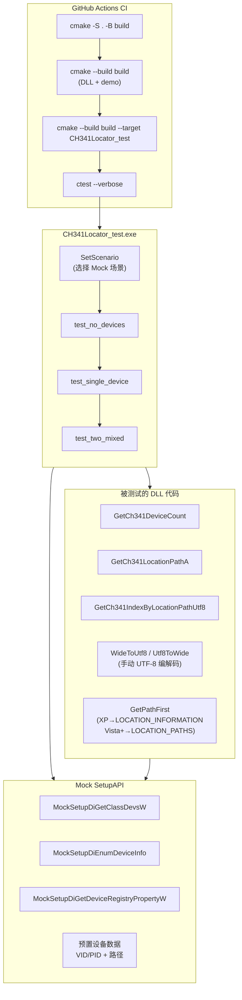

# 自动测试流程



## 测试场景

| 场景 | 模拟设备 | 验证内容 |
|------|---------|---------|
| `kScenarioNoDevices` | 0 个设备 | count=0, path=NULL, 反查=-1 |
| `kScenarioSingleCh341` | 1 个 CH341 | count=1, round-trip path→index, 越界检查 |
| `kScenarioTwoCh341Mixed` | 3 个设备<br/>(CH341 + 非CH341 + CH341) | count=2（跳过非CH341）,<br/>两台路径不同且互不误匹配,<br/>越界检查 |

## 数据流（以 single CH341 为例）

```
SetScenario(&kScenarioSingleCh341)
    │
    ├── GetCh341DeviceCount()
    │       → MockSetupDiGetClassDevsW        返回有效句柄
    │       → MockSetupDiEnumDeviceInfo       返回 1 个设备
    │       → MockSetupDiGetDeviceRegistryPropertyW(SPDRP_HARDWAREID)
    │             返回 "USB\VID_1A86&PID_5523&REV_0100"  → 匹配 CH341
    │       ← count = 1
    │
    ├── GetCh341LocationPathA(0)
    │       → FindCh341(0)                    找到第 0 个 CH341
    │       → GetPathFirst()                  读取 SPDRP_LOCATION_PATHS
    │       → WideToUtf8()                    手动 UTF-8 编码
    │       ← "PCIROOT(0)#PCI(1400)#USBROOT(0)#USB(1)#USB(2)"
    │
    └── GetCh341IndexByLocationPathUtf8(path)
            → Utf8ToWide(path)                手动 UTF-8 解码
            → GetCh341IndexByLocationPath(w)  枚举所有 CH341
            → GetPathFirst()                  读取 SPDRP_LOCATION_PATHS
            → 比较 s == path
            ← index = 0
```
